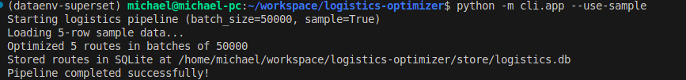
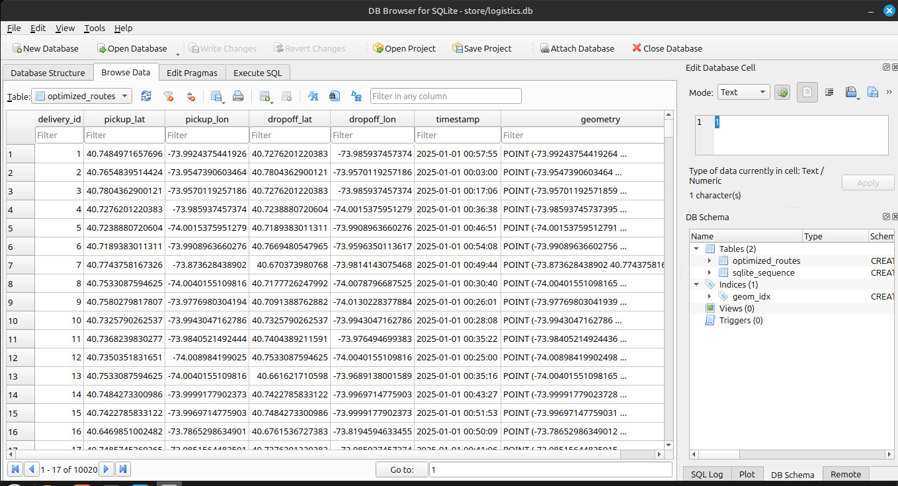

# Logistics Delivery Batch Optimization Pipeline

A CLI tool to batch-process logistics delivery data from NYC TLC yellow taxi trips, optimize the routes, and store the results in SQLite.

### Prerequisites
- Python 3.9+
- MinIO (local S3-compatible storage)

## How I Got Here
Here’s the step-by-step process i followed to build this pipeline:

1. **Downloaded Data from NYC TLC Yellow Taxi Source**:
   - I obtained the January 2024 NYC TLC Yellow Taxi dataset in Parquet format (~1M+ trips) from the official NYC TLC data source:
     ```bash
     mkdir -p data
     wget https://d37ci6vzurychx.cloudfront.net/trip-data/yellow_tripdata_2024-01.parquet -O data/yellow_tripdata_2024-01.parquet
     ```
   - I also downloaded the NYC taxi zone shapefiles for precise coordinate mapping:
     ```bash
     mkdir -p data/taxi_zones
     wget https://d37ci6vzurychx.cloudfront.net/misc/taxi_zones.zip -O data/taxi_zones.zip
     unzip data/taxi_zones.zip -d data/taxi_zones
     rm data/taxi_zones.zip
     ```

2. **Set Up MinIO Locally**:
   - I installed and configured MinIO for object storage to stage the processed CSV data:
     ```bash
     mkdir -p ~/minio-data
     MINIO_ROOT_USER=minioadmin MINIO_ROOT_PASSWORD=minioadmin minio server ~/minio-data --address :9000
     mc alias set local http://localhost:9000 minioadmin minioadmin
     mc mb local/logistics-data
     ```

3. **Ran Conversion Locally and Staged in Memory**:
   - I used `scripts/convert_tlc_to_csv.py` to convert the Parquet data into logistics CSVs (`deliveries_2025_01.csv` and `sample_deliveries.csv`), saved locally, and uploaded to MinIO:
     ```bash
     python -m scripts.convert_tlc_to_csv
     ```
   - The script maps pickup/dropoff locations to precise coordinates using taxi zones, shifts timestamps to 2025, and stages the data in MinIO for pipeline processing.

4. **Processed Data in Memory**:
   - I ingested the CSVs from MinIO into memory using `ingest/load_csv.py`, optimized routes with `optimize/route_optimizer.py` using GeoPandas and NetworkX, and stored results in SQLite with `store/sqlite_writer.py`.
   - The pipeline is orchestrated via a CLI with `cli/app.py`, logging all steps to `logs/logistics.log` in JSON format.

## Setup
1. Clone the repository:
   ```bash
   git clone https://github.com/mykelayo/logistics-optimizer.git
   cd logistics-optimizer

## Usage

```bash
python -m cli.app --use-sample  # Run with sample data
python -m cli.app --no-use-sample  # Run with MinIO TLC data
```


## Screenshots
  
  